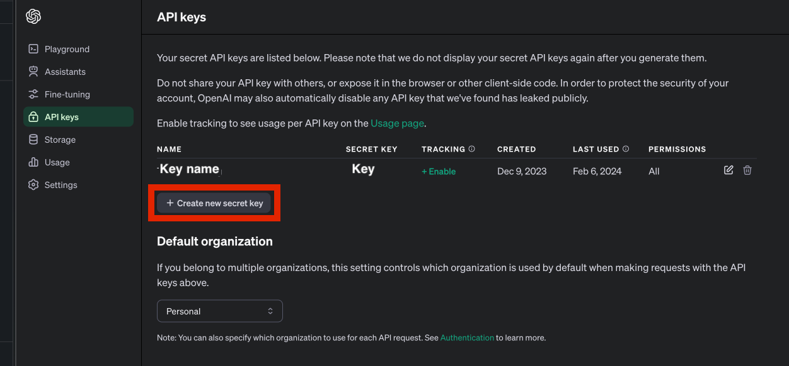

# SoftwareSecurity-SOvsGPT

In class activity for CSC-415 and CSC-515 NCSU to raise awareness of the vulnerabilities between SO and GPT 

## General information

- **Paper:** [https://arxiv.org/abs/2403.15600](https://arxiv.org/abs/2403.15600)
- **Full dataset:** [https://zenodo.org/records/10806611](https://zenodo.org/records/10806611)
- **Prior paper that the dataset is based upon**: [https://ieeexplore.ieee.org/abstract/document/8812042](https://ieeexplore.ieee.org/abstract/document/8812042)

## Understanding the dataset 

There are 3 files:

- `dataset_questions.csv`: The StackOverflow questions analyzed in the paper.
- `dataset_answers.csv`: The StackOverflow selected associated answers analyzed in the paper.
- `dataset_snippets.csv`: The pairs of code snippets from ChatGPT and StackOverflow answers that are compared within the paper.


### Dataset questions

Stores the 87 security related questions. There are 3 columns:
- `question_id`: The id  of the question.
- `title`: The title of the question.
- `body`: The body of the question.


### Dataset answers

Stores the 90 security answers. Some questions, based on the initial dataset, have multiple answers. There are 3 columns:
- `question_id:` The question id associated with the answer.
- `answer_id:` The answer id of the question.
- `body`: The body of the question in HTML.

### Dataset snippets

Stores the 108 pairs betwen StackOverflow and ChatGPT. Each row is a comparison pair. Some answers have multiple snippets. There are 3 columns:
- `question_id:` The question id associated with the answer of the snippet.
- `answer_id:` The answer id of the snippet.
- `snippet_so`: The snippet gathered from StackOverflow.
- `snippet_gpt`: The snippet gathered from ChatGPT.

> [!NOTE]  
> I would probably remove the last column when you give this one, if not they don't really play with the API. Though, if you give it you can also compare if they are the same as my dataset thing, as GPT is non-deterministic. Or maybe, this file may not be needed. Though, getting the snippets in an automated way is sort of hard, but I guess they don't really need to do that in this paper.

> [!IMPORTANT]  
> An answer can also have multiple snippets that are related. Also, it is possible for GPT to also output multiple snippets.

## ChatGPT API

To interact with ChatGPT in an automated manner, one can use the [ChatGPT API](https://platform.openai.com/docs/api-reference). The basic steps on how to configure API usage are the following:

1. Create a ChatGPT account within the [OpenAI page](https://openai.com/blog/chatgpt).

> [!NOTE]  
> I am not sure if one can create an account with the ncsu address. If so, we should probably let them know they need to use something else.

2. Login in your account.

3. In the app screen, select `API`.


4. To use the API, you must fund the API. First, in the sidebard select `Settings > Billing`.


5. Within the `Billing settings` window, you can see your current balance. For the workshop/HW, you will need at least $1 within your account.  

> [!NOTE]  
> A full run cost me last time $0.41. So, if they are doing like half then it's probably some $0.2 if they are doing like 30. I would recommend having like a dollar per run. Should not cost $5 though.


6. Click on `Add to credit balance` to increase the funds of your account if you have less than $1. Add 5 dollars (the minimum allowed by ChatGPT) to your account.

> [!NOTE]  
> We should also probably recommend here to remove the credit card after adding it to the account as it may autocharge the account if it goes above the limit.


7. In the sidebar, click on `API Keys`


8. In the `API Key` window, you can see the different API keys generated within ChatgGPT. 



9. Click in the `API Key` window, create a new secret key. 

10. Fill out the information to create the new secret key. For permissions assign `all`.

> [!NOTE]  
> I had all, but I am not sure if this is a great/secure practice lol.


11. After creating the secret key, you must save the key for usage. You won't be able to view the key again.


12. With the key, you can use the OpenAI API to connect with ChatGPT. For example, the documentation for the [official Python library can be found in the following link](https://github.com/openai/openai-python).

## Example snippet being used for this tutorial


The example snippet to get the code running is the following:

```java
import java.io.*;
import java.security.MessageDigest;

public class MD5Checksum {

   public static byte[] createChecksum(String filename) throws Exception {
       InputStream fis =  new FileInputStream(filename);

       byte[] buffer = new byte[1024];
       MessageDigest complete = MessageDigest.getInstance("MD5");
       int numRead;

       do {
           numRead = fis.read(buffer);
           if (numRead > 0) {
               complete.update(buffer, 0, numRead);
           }
       } while (numRead != -1);

       fis.close();
       return complete.digest();
   }

   // see this How-to for a faster way to convert
   // a byte array to a HEX string
   public static String getMD5Checksum(String filename) throws Exception {
       byte[] b = createChecksum(filename);
       String result = "";

       for (int i=0; i < b.length; i++) {
           result += Integer.toString( ( b[i] & 0xff ) + 0x100, 16).substring( 1 );
       }
       return result;
   }

   public static void main(String args[]) {
       try {
           System.out.println(getMD5Checksum("apache-tomcat-5.5.17.exe"));
           // output :
           //  0bb2827c5eacf570b6064e24e0e6653b
           // ref :
           //  http://www.apache.org/dist/
           //          tomcat/tomcat-5/v5.5.17/bin
           //              /apache-tomcat-5.5.17.exe.MD5
           //  0bb2827c5eacf570b6064e24e0e6653b *apache-tomcat-5.5.17.exe
       }
       catch (Exception e) {
           e.printStackTrace();
       }
   }
}
```

The snippet is from the following [answer](https://stackoverflow.com/questions/304268/). You need to create a file named `MD5Checksum.java` with the code. Additionally, you need to install Java in your computer to get the code running.

## CodeQL CLI

1. You must download the last version of CodeQL CLI. You can find it [within the GitHub webpage](https://github.com/github/codeql-action/releases). You can download the `.gz` file for your operative system.

> [!NOTE] 
> I am not 1005 sure which file I used, I think it was that one.

2. Uncompress the `.gz` file in a folder.

3. Run the following command, within the folder, to test that your CodeQL version is working and setup correctly.

```bash
codeql version
```

4. To run the queries, we must frist create a CodeQL database. 
To do this, run the following command. This will create a `SO` database for java. 
The file that the database will be created will be `MD5Checksum.java`. To compile the file we use the `javac` command.

```bash
codeql database create 'SO' --language=java --command='javac MD5Checksum.java'
```

> [!IMPORTANT] 
> I am not sure if I added an enviornment variable for CodeQL to get this running or where this is needed.

> [!NOTE] 
> You can use a different javac command. Also, you can run multiple files at the same time.

> [!IMPORTANT]
> For Java, CodeQL needs compilable snippets. The documentation says how to make it run in different languages.

5. Generate the analysis for the file. To achieve this, we need to select the queries we are using. For the effect of our study.


```bash
codeql database analyze SO 'LOCATION/java-security-and-quality.qls' --sarif-category=java --format=csv --output='results.csv'
```

> [!NOTE] 
> `LOCATION` is where the `java-security-and-quality.qls` file is.

## Java packages for the snippets to get them to run

Some of the Java snippets generated will require to download packages. To find the packages, as Java does not have an automated package manager system, you can use the dependencies at [Maven Central](https://central.sonatype.com/).

> [!IMPORTANT]  
> Some packages may contain known vulnerabilities.

To run the snippets with the libraries, you can use the following command:

```bash
codeql database create 'SO' --language=java --command='javac MD5Checksum.java'
```

## Mapping the CWEs from CodeQL

When running the CodeQL, different queries are ran. 
In our case, we were using default queries provided within the file `java−security−and−quality.qls`.
Based on the output of the run, potential vulnerabilities may be detected within the code. 
For example, the code may be flagged with the `Use of a broken or risky cryptographic algorithm` query with that name.
You can search for the query that detected the vulnerability within CodeQL. 
In this case, for my particular version this was detected by the query within the `BrokenCryptoAlgorithm.ql` file. The file is shown in the following:

```ql
/**
 * @name Use of a broken or risky cryptographic algorithm
 * @description Using broken or weak cryptographic algorithms can allow an attacker to compromise security.
 * @kind path-problem
 * @problem.severity warning
 * @security-severity 7.5
 * @precision high
 * @id java/weak-cryptographic-algorithm
 * @tags security
 *       external/cwe/cwe-327
 *       external/cwe/cwe-328
 */

import java
import semmle.code.java.security.Encryption
import semmle.code.java.security.BrokenCryptoAlgorithmQuery
import InsecureCryptoFlow::PathGraph

from
  InsecureCryptoFlow::PathNode source, InsecureCryptoFlow::PathNode sink, CryptoAlgoSpec spec,
  BrokenAlgoLiteral algo
where
  sink.getNode().asExpr() = spec.getAlgoSpec() and
  source.getNode().asExpr() = algo and
  InsecureCryptoFlow::flowPath(source, sink)
select spec, source, sink, "Cryptographic algorithm $@ is weak and should not be used.", algo,
  algo.getValue()

```

Additionally, more information of the query can be found, including the associated CWE. 
For this file, the query can be mapped to [CWE-327](https://cwe.mitre.org/data/definitions/327.html) and [CWE-328](https://cwe.mitre.org/data/definitions/328.html).
Lastly, we can also find the supported CWE within the [official documentation](https://docs.github.com/en/code-security/code-scanning/managing-your-code-scanning-configuration/java-kotlin-built-in-queries).


## Reflection questions

> [!NOTE]  
> My ideas of what could be intresting to ask. Very initial/rough ideas all of them.

1. Before this workshop/HW, what was your perception of the security/vulnerabilities of StackOverflow answers?
2. After this workshop/HW, did your perception of the security/vulnerabilities of StackOverflow answers change? How did it change?
3. After this workshop/HW, how will you use StackOverflow for getting answers?
4. Before this workshop/HW, what was your perception of the security/vulnerabilities of ChatGPT or other LLMs for code generation?
    1. (Maybe before all of the following, similar ones can be asked for the StackOverflow ones) Had you used ChatGPT or LLMs? (List of which ones or so)
    2. Had you interacted with the ChatGPT API?
    3. For what software engineering tasks did you use ChatGPT or other LLMs for?
5. After this workshop/HW, did your perception of the security/vulnerabilities of  ChatGPT or other LLMs answers? How did it change?
6. After this workshop/HW, how will you use ChatGPT or other LLMs for code generation?
7. Which platform did you find to be more secure? Explain your answer.
8. What was the effect on the prompts tested with the ChatGPT answers? Explain your answer.
9. Based on your experience, as a developer, how can you deal with insecure propagation from online platforms?

## Intresting papers that may be useful/intresting for the class

- [Asleep at the keyboard? assessing the security of github copilot's code contributions](https://ieeexplore.ieee.org/stamp/stamp.jsp?arnumber=9833571)
- [Towards an understanding of large language models in software engineering tasks](https://arxiv.org/pdf/2308.11396.pdf)
- [You get where you're looking for: The impact of information sources on code security](https://ieeexplore.ieee.org/stamp/stamp.jsp?arnumber=7546508)
- [Snakes in paradise?: Insecure python-related coding practices in stack overflow](https://ieeexplore.ieee.org/stamp/stamp.jsp?arnumber=8816764)
- [Stack overflow considered harmful? the impact of copy&paste on android application security](https://ieeexplore.ieee.org/stamp/stamp.jsp?arnumber=7958574)
- [Do users write more insecure code with AI assistants?](https://dl.acm.org/doi/pdf/10.1145/3576915.3623157)
- [Lost at c: A user study on the security implications of large language model code assistants](https://www.usenix.org/system/files/usenixsecurity23-sandoval.pdf)
- [Is github's copilot as bad as humans at introducing vulnerabilities in code?](https://link.springer.com/article/10.1007/s10664-023-10380-1)